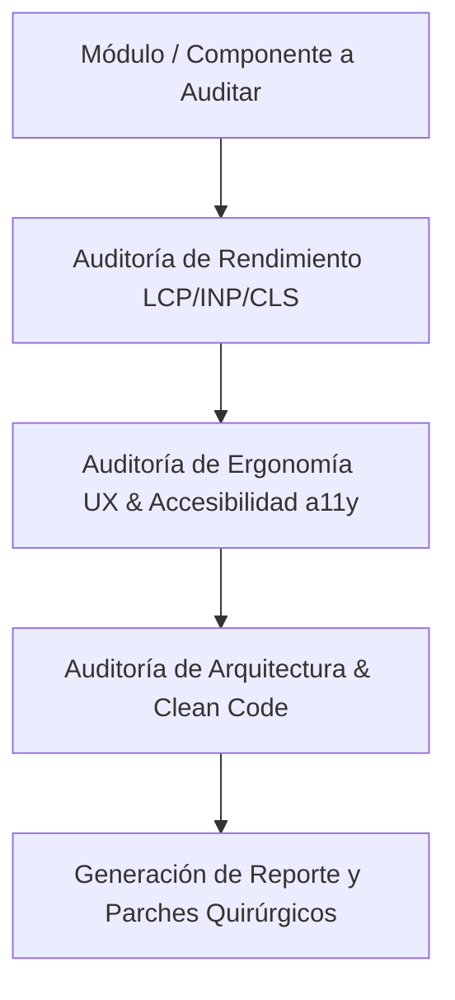

# Agent Skills — Ecosistema de Ingeniería y Calidad (Addy Osmani)

Inspirado en el repositorio [addyosmani/agent-skills](https://github.com/addyosmani/agent-skills), esta habilidad encapsula las mejores prácticas de ingeniería de software moderna, optimización de rendimiento en navegadores, patrones de código limpio y experiencia de usuario para agentes de desarrollo.

## 1. Pilares de Especialidad

### A. Web Performance & Core Web Vitals
- **LCP (Largest Contentful Paint < 2.5s):** Priorización de recursos críticos, lazy loading inteligente de imágenes y optimización de render blocking assets.
- **INP (Interaction to Next Paint < 200ms):** Descomposición de tareas largas en el hilo principal (`requestAnimationFrame`, `scheduler.yield()`, web workers).
- **CLS (Cumulative Layout Shift < 0.1):** Reserva explícita de dimensiones en elementos multimedia (`aspect-ratio`, `width`/`height`), prevención de inyección dinámica no contenida.

### B. UX Engineering & Ergonomía de Software
- **Feedback Inmediato:** Indicadores visuales de carga en <100ms tras la interacción del usuario.
- **Micro-interacciones Fluidas:** Transiciones CSS aceleradas por GPU (`transform`, `opacity`), evitando repaints innecesarios.
- **Estados Vacíos y de Error:** Diseño defensivo de UIs con pantallas de fallback y mensajes orientados a la acción.

### C. Clean Code & Refactoring
- **Funciones de Responsabilidad Única (SRP):** Máximo 30-50 líneas por función.
- **Inmutabilidad Estricta:** No mutar parámetros ni estado global; retornar copias profundas o inmutables.
- **Eliminación de Complejidad Ciclomática:** No más de 3 niveles de anidamiento de condicionales.

---

## 2. Flujo de Auditoría con Agent Skills

Al invocar `/agent-skills` o auditar un módulo:

### Directrices de Aplicación Obligatoria en FerreOn:
1. Todo componente frontend en Next.js/React o Vanilla JS debe someterse a revisión de CLS y accesibilidad.
2. Ningún manejador de eventos de usuario puede bloquear el hilo principal por más de 50ms sin actualización optimista.
3. Se debe aplicar el patrón de *Skeleton Loading* en lugar de spinners globales bloqueantes.
