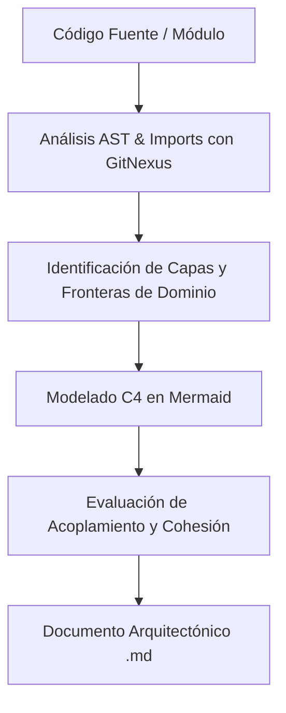

# Archify — Ingeniería y Visualización de Arquitectura de Software

Inspirado en el repositorio [tt-a1i/archify](https://github.com/tt-a1i/archify), esta habilidad proporciona capacidades para analizar proyectos de software, extraer topologías de dependencias y generar documentación arquitectónica formal basada en el modelo **C4** y diagramas **Mermaid**.

## 1. Niveles del Modelo C4 Soportados

1. **Nivel 1: Diagrama de Contexto del Sistema:** Muestra el sistema en relación con los usuarios finales y sistemas externos (Supabase, Google Apps Script, APIs bancarias, etc.).
2. **Nivel 2: Diagrama de Contenedores:** Visualiza las aplicaciones desplegables, bases de datos y microservicios (Next.js Frontend, Backend Node/GAS, PostgreSQL/Supabase, Redis).
3. **Nivel 3: Diagrama de Componentes:** Detalla los controladores, servicios, repositorios y adaptadores dentro de un contenedor específico.
4. **Nivel 4: Diagrama de Código / Flujo de Secuencia:** Modela flujos transaccionales críticos (ej. facturación, movimientos de inventario, cálculo de nómina).

---

## 2. Flujo de Ejecución de `/archify`

### Reglas de Diagramación Obligatorias:
- Usar sintaxis Mermaid nativa en bloques `mermaid`.
- Etiquetar claramente las tecnologías y protocolos en cada conector (`[HTTPS/JSON]`, `[Postgres Wire]`, `[gRPC]`).
- Identificar puntos únicos de falla (SPOF) y cuellos de botella de concurrencia.

---

## 3. Integración Obligatoria en FerreOn & AppFrios Pezca

Antes de realizar cambios arquitectónicos de gran escala (migración de backend, adición de nuevos microservicios o cambios en el pipeline de datos transaccionales), el agente **DEBE** ejecutar `/archify` para generar el diagrama antes/después en el artefacto de especificación de Spec-Kit (`spec.md` / `plan.md`).
