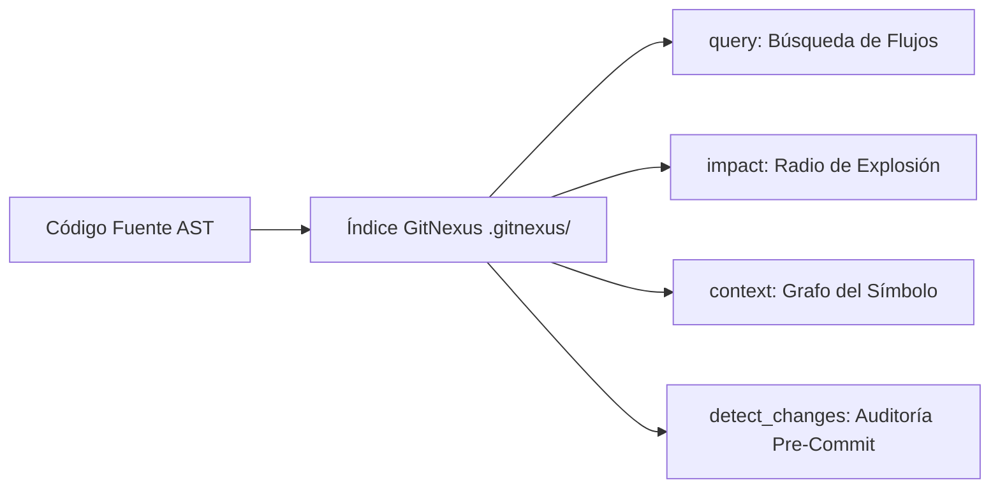

# GitNexus — Code Intelligence & Graph Navigation

GitNexus analiza el AST del repositorio y construye un grafo de conocimiento de código con símbolos, relaciones y flujos de ejecución.

---

## 1. Comandos Principales de GitNexus



### Tabla de Herramientas:
| Herramienta | Propósito | Cuándo usar |
| :--- | :--- | :--- |
| `impact({target, direction: "upstream"})` | Evalúa qué romperá un cambio en el símbolo | **SIEMPRE** antes de editar una función, clase o método |
| `query({search_query})` | Busca flujos de ejecución agrupados por procesos | Al explorar código desconocido |
| `context({name})` | Retorna callers, callees y flujos asociados | Al necesitar el mapa completo de un símbolo |
| `detect_changes({scope})` | Audita qué símbolos y procesos fueron afectados | Antes de hacer commit o abrir PR |
| `explain({target})` | Análisis de seguridad y flujo de datos (Taint analysis) | Auditorías de seguridad |

---

## 2. Niveles de Riesgo de Impacto

| Profundidad | Nivel de Riesgo | Significado |
| :--- | :--- | :--- |
| **d = 1** | **CRÍTICO / SE ROMPERÁ** | Invocadores e importadores directos |
| **d = 2** | PROBABLEMENTE AFECTADO | Dependencias indirectas |
| **d = 3** | REQUIERE PRUEBAS | Efectos transitivos |

---

## 3. Mantenimiento del Índice

Si el índice está desactualizado (*stale*):
```bash
# Re-indexar proyecto
node .gitnexus/run.cjs analyze
```
