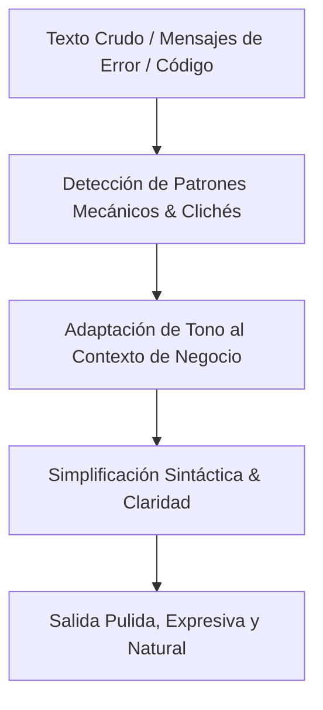

# Humanizer — Refinamiento y Humanización de Software y Comunicación

Inspirado en el repositorio [blader/humanizer](https://github.com/blader/humanizer), esta habilidad transforma textos técnicos, comentarios de código, mensajes de error de usuario y documentación en comunicaciones humanas, directas, empáticas y profesionales, libres de jerga mecánica o patrones repetitivos de IA.

## 1. Principios de Humanización

### A. En Textos de Interfaz de Usuario (UI/UX)
- **Mensajes de Error Orientados a la Solución:**
  - ❌ *Robótico:* "Error 500: Fallo en la persistencia del socket en la capa de datos."
  - ✅ *Humano:* "No pudimos guardar los cambios por un problema de conexión. Intenta de nuevo en unos momentos o verifica tu red."
- **Botones y Call-To-Action Claros:**
  - ❌ *Mecánico:* "Ejecutar proceso de mutación."
  - ✅ *Humano:* "Confirmar y Guardar Pedido."

### B. En Código y Comentarios de Desarrollo
- **Comentarios Significativos ("Por qué", no "Qué"):**
  - ❌ *Obvio/IA:* `// Incrementar el contador i en 1`
  - ✅ *Humano:* `// Offset requerido por la paginación base-1 de la API de Google Sheets`
- **Nomenclatura Expresiva de Variables:**
  - Nombres legibles en contexto de negocio (`saldoPendienteCliente`, `diasAlmacenamiento`) en vez de genéricos (`temp1`, `dataArr`).

---

## 2. Flujo de Ejecución con `/humanizer`

### Reglas para el Agente:
1. En toda respuesta explicativa al usuario, mantener un tono conversacional directo, profesional y en español claro.
2. En las interfaces del ERP (`ferreon-erp-nextjs`), verificar que las etiquetas, placeholders y tooltips estén redactados desde la perspectiva del usuario operativo de ferretería o pezcadera.
