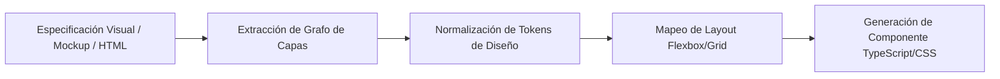

# Open Design — Framework de Interoperabilidad de Diseño a Código

Inspirado en el repositorio [nexu-io/open-design](https://github.com/nexu-io/open-design), esta habilidad permite procesar árboles de diseño (Figma/Penpot/Sketch/HTML/CSS), extraer estructuras jerárquicas y generar componentes limpios, accesibles y desacoplados para la web.

## 1. Capacidades Principales

1. **Design Tree Parsing:** Convierte representaciones vectoriales o árboles DOM en un grafo agnóstico de componentes de UI.
2. **Token Extraction:** Identifica automáticamente tokens semánticos (colores primarios, secundarios, espaciados, radios de borde, tipografías y sombras).
3. **Component Atomization:** Descompone interfaces complejas en átomos, moléculas y organismos bajo Atomic Design.
4. **Framework-Agnostic Code Synthesis:** Genera código limpio en HTML/Vanilla CSS, React/JSX o Tailwind CSS sin dependencias propietarias.

---

## 2. Flujo de Transformación de Diseño

Al ejecutar `/open-design`:

### Protocolo de Extracción de Componentes:
- **Paso 1 (Tokens):** Mapear todas las propiedades visuales a variables CSS globales (`--color-primary`, `--space-md`, etc.).
- **Paso 2 (Semántica):** Asignar etiquetas HTML5 semánticas (`<header>`, `<nav>`, `<main>`, `<article>`, `<button>`).
- **Paso 3 (Responsividad):** Diseñar bajo enfoque Mobile-First con breakpoints estandarizados (`sm: 640px`, `md: 768px`, `lg: 1024px`, `xl: 1280px`).
- **Paso 4 (Accesibilidad):** Añadir atributos ARIA requeridos (`aria-label`, `aria-expanded`, `role`).

---

## 3. Uso en el Ecosistema FerreOn

- Generar componentes del ERP frontend (`ferreon-erp-nextjs`) basados en especificaciones visuales.
- Mantener sincronizados los tokens entre `DESIGN.md` y los estilos CSS globales.
