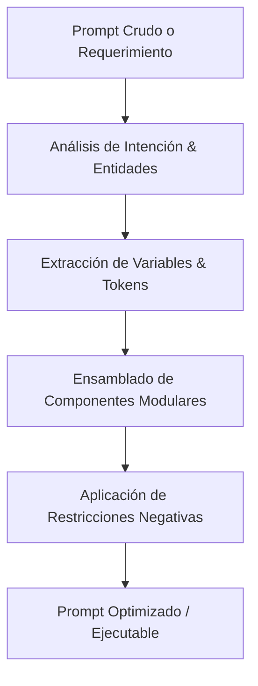

# Ponytail — Engine de Tailoring y Optimización de Prompts

Inspirado en el repositorio [DietrichGebert/ponytail](https://github.com/DietrichGebert/ponytail), esta habilidad proporciona capacidades avanzadas para el diseño, compresión semántica, ensamblado modular y ejecución de pipelines de prompts para LLMs y agentes autónomos.

## 1. Principios Fundamentales de Ponytail

1. **Context Slicing (Corte Quirúrgico de Contexto):** Inyectar únicamente las porciones de información relevantes para la tarea actual, evitando la saturación del context window.
2. **Modular Prompt Composition:** Ensamblar prompts a partir de bloques reutilizables (Persona, Contexto, Tarea, Restricciones Negativas, Ejemplos Few-Shot y Esquema de Salida).
3. **Dynamic Variable Tailoring:** Tipado estricto e interpolación segura de variables de entrada para evitar inyecciones de prompt o ambigüedades.
4. **Deterministic Output Enforcement:** Forzado de salidas estructuradas mediante contratos JSON o Markdown tipados.

---

## 2. Flujo de Trabajo Operativo

Cuando se invoque la habilidad o el comando `/ponytail`:



### Paso 1: Deconstrucción del Requerimiento
Identificar:
- **Rol experto requerido:** Hiperespecífico al problema de negocio o técnico.
- **Entradas dinámicas:** Parámetros variables que cambiarán entre ejecuciones.
- **Restricciones negativas obligatorias:** Lo que el modelo **NUNCA** debe hacer.

### Paso 2: Modularización
Componer el prompt bajo el siguiente formato canónico:

```markdown
<SYSTEM_PROMPT>
[Definición de rol + Especialidad + Tono]
</SYSTEM_PROMPT>

<CONTEXT>
[Antecedentes de negocio + Reglas de dominio + Invariantes]
</CONTEXT>

<TASK>
[Objetivo principal + Subtareas secuenciales numeradas]
</TASK>

<CONSTRAINTS>
- [Must do: Acciones obligatorias]
- [Must NOT do: Prohibiciones explícitas]
</CONSTRAINTS>

<OUTPUT_FORMAT>
[Definición estricta de estructura y lenguaje]
</OUTPUT_FORMAT>
```

### Paso 3: Validación de Idempotencia y Compresión
- Reducir tokens redundantes.
- Comprobar que no existan contradicciones entre el contexto y las restricciones.

---

## 3. Casos de Uso en FerreOn & AppFrios Pezca

- **Generación de Prompts para Subagentes:** Estandarizar tareas enviadas a subagentes de Ruflo o Claude Code.
- **Scripts de Automatización y Migración:** Formatear instrucciones para scripts de mantenimiento de datos sin ambigüedades.
- **Consultas a Modelos de Visión o Documentos:** Estructurar prompts para procesar facturas, órdenes de compra o tickets de pesaje.
