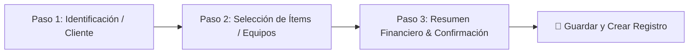

# Responsive Wizard & Stepped Modal Form Patterns

Este skill documenta los principios de diseño de interfaz de usuario (UI/UX) para transformar formularios complejos y saturados en **Wizards Responsivos** de alta legibilidad y conversión.

---

## 1. Principios de Diseño para Wizards

### A. Divulgación Progresiva (Progressive Disclosure)
- Descomponer formularios de más de 6 campos en pasos lógicos temáticos (2 a 4 pasos máximo).
- Reducir la carga cognitiva del operador mostrando solo los campos relevantes en la fase actual.

### B. Barra de Acciones Fija (Sticky Action Footer)
- Los botones principales (`Cancelar`, `Anterior`, `Continuar`, `Guardar`) DEBEN estar fijados en la parte inferior del viewport del modal (`sticky bottom-0 bg-white/95 backdrop-blur-md`).
- El botón de guardado primario nunca debe perderse en el scroll del contenido.

### C. Dimensiones Adaptativas al Viewport
- **Móvil (<640px):** `max-h-[95vh]`, `p-3`, formularios de 1 sola columna.
- **Tablet (640px - 1024px):** `max-w-2xl` o `max-w-3xl`, `grid-cols-2`.
- **Desktop (>1024px):** `max-w-4xl`, `grid-cols-3` o `grid-cols-4` para selectores de fecha y campos numéricos compactos.

### D. Stepper Visual Interactivo
- Mostrar un indicador numérico circular con estado activo (`bg-brand-salmon text-white`), completado (`✓ bg-emerald-500`) y pendiente (`bg-slate-200`).
- Permitir al usuario saltar directamente a pasos previamente validados.
