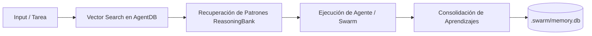

# Ruflo — Memory & ReasoningBank Guide

Este skill proporciona las directivas para gestionar la memoria episódica, semántica y procedural en proyectos con Ruflo AI.

## 1. Arquitectura de Memoria



## 2. Componentes de Memoria

1. **`.swarm/memory.db`**: Base de datos SQLite local que almacena embeddings vectoriales y grafos de razonamiento.
2. **`ReasoningBank`**: Colección de heurísticas y lecciones aprendidas validadas tras resolver defectos complejos.
3. **`AgentDB`**: Capa de acceso de baja latencia para que múltiples subagentes consulten decisiones previas sin re-procesar tokens.

## 3. Comandos de Consulta

- **Consultar Decisiones Previas:**
  ```javascript
  // Búsqueda de contexto en AgentDB
  const results = await agentDb.query({
    text: "Manejo de estado en alquileres y bodega",
    limit: 5,
    threshold: 0.8
  });
  ```
- **Guardar Heurística Validada:**
  ```javascript
  await reasoningBank.storePattern({
    domain: "frontend-state",
    problem: "Pérdida de reactividad al particionar page.tsx en App Router",
    solution: "Usar Zustand con persist middleware y RealtimeProvider en layout.tsx",
    confidence: 0.95
  });
  ```
