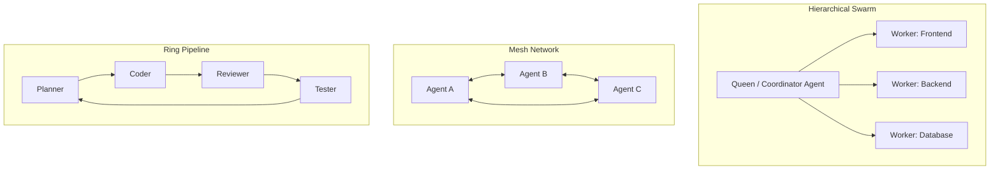

# Ruflo — Multi-Agent Swarm Orchestration & Intelligence Framework

**Ruflo** (desarrollado por `@ruvnet`) es el motor líder para coordinar enjambres (*swarms*) de agentes autónomos, memoria compartida persistente, grafos de ejecución y pipelines de desarrollo adaptativos.

---

## 1. Topologías de Enjambre (Swarm Topologies)

Ruflo soporta 4 topologías de coordinación según la complejidad del requerimiento:



1. **Jerárquica (Hierarchical):** Un agente coordinador (Lead/Queen) descompone el problema, delega a subagentes especialistas y sintetiza la solución. Ideal para proyectos grandes.
2. **Malla (Mesh):** Agentes colaboran entre pares sin nodo central, compartiendo memoria y eventos en tiempo real. Ideal para optimizaciones transversales y refactorización continua.
3. **Anillo (Ring Pipeline):** Ejecución secuencial por etapas (Spec -> Plan -> TDD -> Code -> Review -> E2E). Ideal para pipelines CI/CD y flujos Speckit.
4. **Estrella (Star / Hub-and-Spoke):** Un bus central de memoria (`ReasoningBank` / `AgentDB`) conecta agentes desacoplados.

---

## 2. Roles Especializados de Agentes

| Rol Ruflo | Responsabilidad | Disparador |
| :--- | :--- | :--- |
| **Swarm Coordinator** | Descompone objetivos complejos, asigna presupuesto de tokens y orquesta entregables | `/goal`, `/swarm-start` |
| **System Architect** | Diseña contratos de API, esquemas de BD, modelos de dominio y diagramas de flujo | Nuevos módulos, migraciones |
| **TDD / Feature Coder** | Escribe pruebas unitarias antes de implementar código productivo | Ciclo TDD (Red -> Green -> Refactor) |
| **Adversarial Reviewer** | Audita seguridad, cobertura de tests, performance y adherencia a estándares | Pre-commit, pull requests |
| **Memory / Knowledge Keeper** | Persiste patrones aprendidos en ReasoningBank y actualiza memorias episódicas | `/learn`, post-resolución |

---

## 3. Niveles de Memoria (Memory Tiering)

Ruflo integra 3 capas de memoria persistente:
1. **Episódica (Sesión):** Historial de comandos, snapshots de estado y decisiones tomadas en la sesión actual.
2. **Semántica (AgentDB / Vector):** Embeddings vectoriales de funciones, entidades de dominio y documentación en `.swarm/memory.db`.
3. **Procedural (ReasoningBank):** Patrones de resolución de problemas validados (ej. cómo resolver errores de SSL en Windows, cómo migrar stores a Zustand).

---

## 4. Comandos y Workflows de Ruflo

```bash
# Iniciar enjambre jerárquico para una funcionalidad
ruflo swarm init --topology hierarchical --agents architect,coder,reviewer

# Consultar memoria semántica / patrones pasados
ruflo memory query "patrones de idempotencia en frontend"

# Ejecutar ciclo de aprendizaje post-tarea
ruflo learn --extract-patterns --save-reasoningbank
```

---

## 5. Reglas de Integración con el Proyecto

- **Nunca mutar estado sin consenso:** En enjambres de desarrollo, el agente `Reviewer` debe validar antes de que el `Coordinator` marque una tarea como terminada.
- **Sincronización con GitNexus:** Los agentes Ruflo deben consultar el grafo de dependencias de GitNexus (`query`, `impact`) antes de iniciar modificaciones de código.
