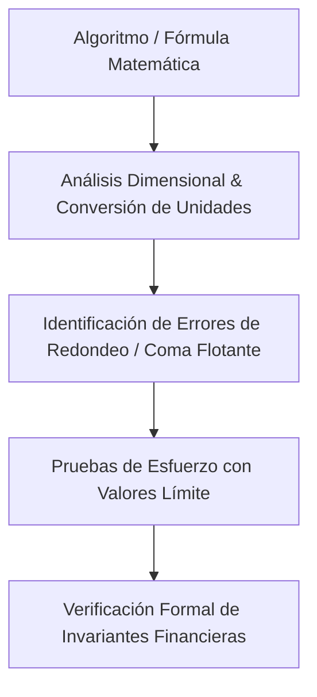

# Scientific Agent Skills — Rigor Matemático y Análisis Numérico

Inspirado en el repositorio [K-Dense-AI/scientific-agent-skills](https://github.com/K-Dense-AI/scientific-agent-skills), esta habilidad dota al agente de protocolos rigurosos para la formulación, prueba y validación de algoritmos matemáticos, cálculos financieros, conversiones de unidades y análisis de datos transaccionales.

## 1. Principios de Validación Científica

1. **Aritmética de Punto Flotante Segura:**
   - Prohibido realizar operaciones financieras o de pesaje directo en tipos `float`/`double` nativos sin escala de enteros o librerías de precisión fija (ej. almacenar gramos enteros en lugar de kilos fraccionarios en BD).
2. **Pruebas de Invarianza y Propiedades (Property-Based Testing):**
   - Validar algoritmos con generadores de casos extremos (cero, valores negativos, desbordamiento numérico, NaN, infinitos).
3. **Reproducibilidad y Determinismo:**
   - Todo algoritmo de cálculo (tarifas de frío, facturación, intereses, prorrateo de stock) debe ser una función pura y determinista: a igual entrada, idéntica salida garantizada.

---

## 2. Flujo de Verificación con `/scientific-skills`

### Reglas Críticas para FerreOn & AppFrios Pezca:
- **Conversión Gramos vs Kilos:** Todo pesaje en AppFrios Pezca se almacena internamente en **Gramos Enteros (`peso_kg * 1000`)**. El cálculo de cobro por almacenamiento o servicios debe realizar la conversión explícita sin pérdida de decimales.
- **Conciliación de Sumatorias:** La suma de los detalles de movimiento (`MOV_DETAIL`) debe igualar exactamente al totalizador de la cabecera (`MOV_HEADER`).
