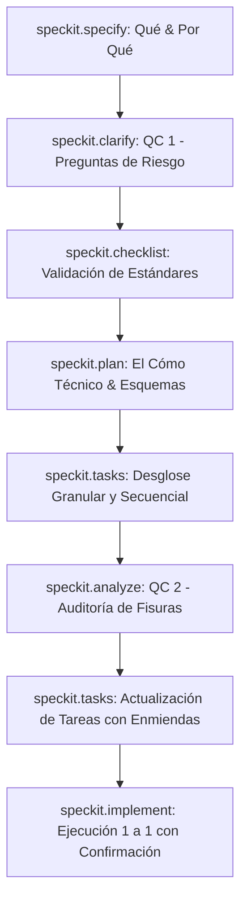

# Metodología de Especificación y Flujo de Trabajo Speckit

Este skill define el protocolo riguroso para abordar tareas complejas de refactorización, migración o desarrollo de funcionalidades asegurando cero ambigüedad, control de calidad continuo y ejecución paso a paso con confirmación del usuario.

## 1. Ciclo de Comandos Speckit

Cuando el usuario invoque o guíe el desarrollo mediante comandos Speckit, se debe seguir estrictamente este orden:

### Reglas por Fase:
1. **`/speckit.specify`**: Define el "Qué" y el "Por qué" en un artefacto PRD. **PROHIBIDO generar código.**
2. **`/speckit.clarify`**: Formula preguntas estructuradas para mitigar riesgos y alinear decisiones arquitectónicas.
3. **`/speckit.checklist`**: Verifica requerimientos contra estándares de la industria (idempotencia, escalabilidad, UX).
4. **`/speckit.plan`**: Define componentes, esquemas de datos y flujos de información técnica (el "Cómo").
5. **`/speckit.tasks`**: Traduce el plan en tareas granulares, secuenciales y accionables en `task.md`.
6. **`/speckit.analyze`**: Audita la consistencia cruzada (Spec -> Plan -> Tasks) buscando fisuras, fugas de memoria o componentes huérfanos.
7. **`/speckit.implement`**:
   - Ejecuta **UNA SOLA tarea a la vez**.
   - Al terminar cada bloque de código, **DETENERSE y esperar confirmación explícita del usuario** antes de avanzar a la siguiente.

---

## 2. Patrones de Arquitectura Frontend Zero-Latency & Idempotencia

Para aplicaciones SPA de alto rendimiento (Next.js App Router + Zustand + Supabase):

### A. Prevención de Doble Click & Bloqueo Físico
- Componente `Button` debe aceptar `isLoading?: boolean`.
- Cuando `isLoading === true`, inyectar animación SVG de spinner y deshabilitar interacción física (`pointer-events-none disabled:opacity-50`).

### B. Llaves de Idempotencia y Garbage Collection
- Generar llaves criptográficas únicas por transacción (`crypto.randomUUID()` o fallback con prefijo).
- Implementar `IdempotencyManager` con límite FIFO (ej. 50 llaves) para evitar **Memory Leaks** en sesiones prolongadas.
- Validar y rechazar mutaciones duplicadas si la llave ya existe en memoria.

### C. Zustand Optimistic Updates con Snapshot Rollback
- Persistir estado local en caché (`zustand/middleware/persist`) para renderizado instantáneo (0 ms).
- En mutaciones asíncronas, mutar la UI inmediatamente.
- Guardar snapshot previo y proveer método `restoreSnapshot()` en el store para ejecutar **Rollback Optimista** si la petición de backend falla.

### D. Sincronización en Tiempo Real (WebSockets)
- Escuchar eventos `postgres_changes` de Supabase en segundo plano (`INSERT`, `UPDATE`, `DELETE`) para alimentar los stores de Zustand sin necesidad de recargar la página.
