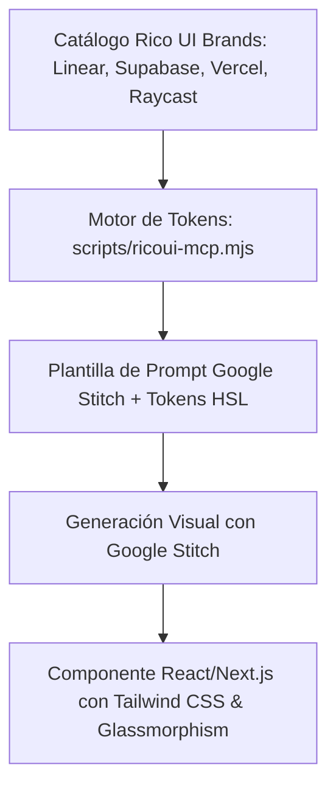

# Stitch & Rico UI Brands — Motor de Generación y Diseño Visual

Esta habilidad combina las capacidades de prototipado y generación de componentes de **Google Stitch** con la biblioteca de tokens y sistemas de diseño de marcas globales de **Rico UI Brands** ([design.ricoui.com/brands](https://design.ricoui.com/brands)), adaptándolas al estándar **Dark Mode Glassmorphism** de FerreOn ERP & AppFrios Pezca.

---

## 1. Arquitectura de Integración



### Herramientas Disponibles en el Motor CLI/MCP:
- `node scripts/ricoui-mcp.mjs list`: Lista todos los sistemas de marcas preconfigurados.
- `node scripts/ricoui-mcp.mjs get <brand>`: Extrae la paleta cromática, tipografías y tokens de la marca especificada.
- `node scripts/ricoui-mcp.mjs stitch <component> <brand> <purpose>`: Genera un prompt listo para ser inyectado en Google Stitch.

---

## 2. Presets de Marca Disponibles (Rico UI)

| Marca | Estilo Visual | Paleta Clave |
| :--- | :--- | :--- |
| **FerreOn / Pezca** | Industrial Steel Blue & Polar Ice Cyan | `--color-primary-500` (Azul Acero), `#06b6d4` (Cyan Frío), Slate 950 |
| **Linear** | Alto contraste, micro-bordes elegantes | Navy-Black (`#08090d`), Electric Violet/Cyan, blur-xl |
| **Supabase** | Verde esmeralda para desarrolladores | Slate Dark (`#11181c`), Emerald (`#3ecf8e`), Monospace accents |
| **Vercel** | Precisión monocromática pura | Pure Black (`#000000`), Pure White (`#ffffff`), 1px sharp borders |
| **Raycast** | Resplandor coral y crimson oscuro | Charcoal Dark (`#16161d`), Coral-Red (`#ff6363`), Warm blur-2xl |

---

## 3. Protocolo de Generación con Google Stitch

1. **Definir la Intención y Marca:** Seleccionar la vista (ej. `InvoiceDetailModal`) y el estilo base (ej. `linear` o `ferreon`).
2. **Generar el Prompt Estructurado:**
   ```bash
   node scripts/ricoui-mcp.mjs stitch "InvoiceDetailModal" "ferreon" "Modal flotante para liquidar facturas con tabla de pesajes y totales"
   ```
3. **Validar Invariantes de Diseño en el Código Generado:**
   - [ ] Uso de `backdrop-blur-md` o `backdrop-blur-xl` en contenedores.
   - [ ] Bordes translúcidos (`border-white/10` o `border-slate-800/80`).
   - [ ] Resplandor ambiental de fondo (`blur-3xl` orbs fijos).
   - [ ] Estados interactivos: `hover:-translate-y-0.5`, `active:scale-95`.
   - [ ] Adaptabilidad móvil con vistas de tarjetas.
