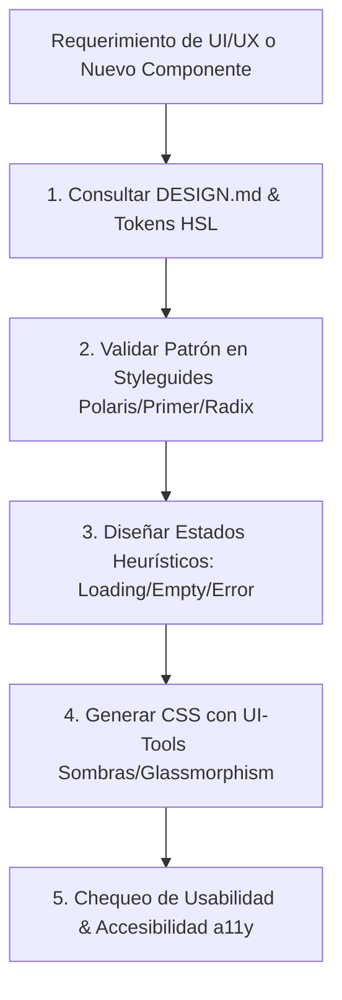

# UI/UX Ecosystem — Ecosistema Maestro de Diseño y Experiencia de Usuario

Este skill consolida los 7 repositorios y plataformas de referencia mundial en diseño de interfaces y experiencia de usuario web como **Ground Truth obligatorio** para el desarrollo visual en FerreOn y AppFrios Pezca.

---

## 1. Mapa de Fuentes y Repositorios Integrados

| Repositorio / Recurso | Especialidad & Propósito |
| :--- | :--- |
| **[penpot/penpot](https://github.com/penpot/penpot)** | Plataforma open-source de diseño y prototipado colaborativo; generación de layouts SVG, CSS Grid/Flexbox y tokens de diseño estándar. |
| **[goabstract/Awesome-Design-Tools](https://github.com/goabstract/Awesome-Design-Tools)** | Directorio maestro de herramientas profesionales de arquitectura de información, accesibilidad (a11y), tipografía y paletas cromáticas. |
| **[maxbogo/awesome-ai-tools-for-ui](https://github.com/maxbogo/awesome-ai-tools-for-ui)** | Herramientas de IA para generación de componentes, paletas inteligentes (Stitch, 21st.dev) y automatización de interfaces. |
| **[kevindeasis/awesome-ui](https://github.com/kevindeasis/awesome-ui)** | Checklists de usabilidad (Nielsen Norman), iconografía vectorial, heurísticas de interacción y librerías de prototipado. |
| **[voltagent/awesome-design-md](https://github.com/voltagent/awesome-design-md)** | Especificación canónica `DESIGN.md` para definición de sistemas de diseño en texto plano para agentes de IA (tokens HSL, tipografía, radios, sombras). |
| **[streamich/awesome-styleguides](https://github.com/streamich/awesome-styleguides)** | Compendio de Design Systems en producción real (Shopify Polaris, GitHub Primer, Radix UI, Microsoft Fluent, Tailwind UI). |
| **[ui-layouts/ui-tools](https://github.com/ui-layouts/ui-tools)** | Generadores avanzados de utilidades CSS: sombras multinivel, patrones de fondo vectoriales, efectos de glassmorphism y micro-animaciones. |

---

## 2. Flujo de Gobernanza UI/UX Obligatorio

Antes de escribir código visual (HTML, CSS, React/Next.js, componentes visuales):

---

## 3. Directrices Inviolables de Interfaz en FerreOn

1. **Tokens Centralizados:** Ningún componente puede usar colores hex hardcodeados (ej. `#1a2b3c`); **DEBE** usar variables CSS semánticas definidas en `DESIGN.md` (ej. `var(--color-primary-600)`).
2. **Micro-interacciones y Estados de Carga:** Todos los botones interactivos deben contar con transiciones `ease-out`, estados hover/active perceptibles y soporte para estados de carga con spinners SVG sin bloqueo físico.
3. **Contraste y Accesibilidad (WCAG 2.1 AA):** Razón de contraste mínima de 4.5:1 en texto normal y 3:1 en texto grande.
4. **Diseño Adaptativo / Responsivo:** Interfaces multi-dispositivo fluidas utilizando CSS Grid y Flexbox moderno con breakpoints móviles claros.
