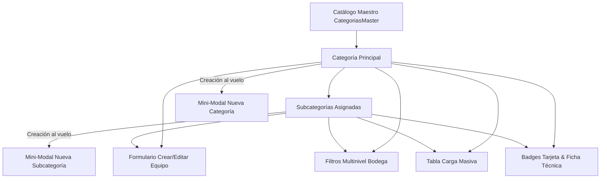

# ADR 0004: Taxonomía Jerárquica Dinámica de Categorías y Subcategorías para Equipos e Inventario

## Contexto y Declaración del Problema

El ERP requería mayor granularidad y flexibilidad en la catalogación de equipos de construcción y maquinaria. Anteriormente, la categorización consistía únicamente en un texto plano de categoría sin una taxonomía jerárquica estandarizada ni capacidad de asociar subcategorías especializadas (ej. `MAQUINARIA › CONCRETO`, `HERRAMIENTAS › PERFORACIÓN`, `GENERACIÓN › PLANTAS ELÉCTRICAS`).

Adicionalmente, los operadores en obra y bodega necesitaban:
1. Crear categorías y subcategorías "al vuelo" desde el formulario individual sin abandonar el flujo de creación.
2. Filtrar y consultar el catálogo en Bodega mediante selectores dependientes Multinivel (`Categoría` y `Subcategoría`).
3. Disponer de categorización asistida en la tabla de Carga Masiva y compatibilidad retroactiva en el parser CSV/Excel (soportando tanto esquemas de 5 como de 6 columnas).

## Decisión de Arquitectura

Se implementó una arquitectura de taxonomía dinámica multinivel en el dominio, backend y frontend:

1. **Extensión del Dominio (`EquipoEntity`)**:
   - Se añadió la propiedad `subcategoria: string = "GENERAL"` con sanitización automática en mayúsculas y trim (`sanitizar()`).
   - Se mantuvieron intactas las invariantes de balance de stock y validaciones de negocio.

2. **DTOs y Casos de Uso (`equipo-use-cases.ts`)**:
   - `CrearEquipoDTO`, `CargaMasivaEquipoDTO` y `EditarEquipoDTO` se actualizaron para recibir y procesar `subcategoria?: string`.

3. **API Routes (`/api/equipos`, `/api/equipos/[id]`)**:
   - Se ampliaron los esquemas de validación Zod con `subcategoria: z.string().optional()`.

4. **Frontend React (`src/app/page.tsx`)**:
   - **Catálogo Maestro**: Estado central `categoriasMaster: CategoriaDef[]` con presets de la industria y persistencia en memoria/sesión.
   - **Creación Dinámica al Vuelo**: Mini-modales reactivos para creación instantánea de Categorías y Subcategorías dentro del formulario de equipo.
   - **Filtros Reactivos en Bodega**: Selectores de `Categoría` y `Subcategoría` dependientes con sincronización bidireccional.
   - **Tarjetas y Ficha Técnica**: Badges jerárquicos visuales `CATEGORIA › SUBCATEGORIA` con tipografía e iconos temáticos (`FolderPlus`, `Tags`).
   - **Carga Masiva Asistida**: Tabla interactiva con selects de categoría/subcategoría por fila y parser CSV flexible.

## Diagrama de Taxonomía y Flujo

## Consecuencias

### Positivas
- **Organización Estructurada**: Permite agrupar con precisión cientos de referencias de equipos.
- **Experiencia de Usuario Fluida**: La creación al vuelo evita tener que ir a un módulo de configuración separado para registrar una nueva familia de maquinaria.
- **Compatibilidad Retroactiva Total**: Los ítems existentes y los CSV antiguos de 5 columnas se asignan automáticamente a la subcategoría `"GENERAL"`.
- **Cobertura de Pruebas**: 32/32 tests unitarios pasando y TypeScript typecheck / build 100% limpios.

### Estado
- **Aceptado e Implementado**: 2026-08-19.
