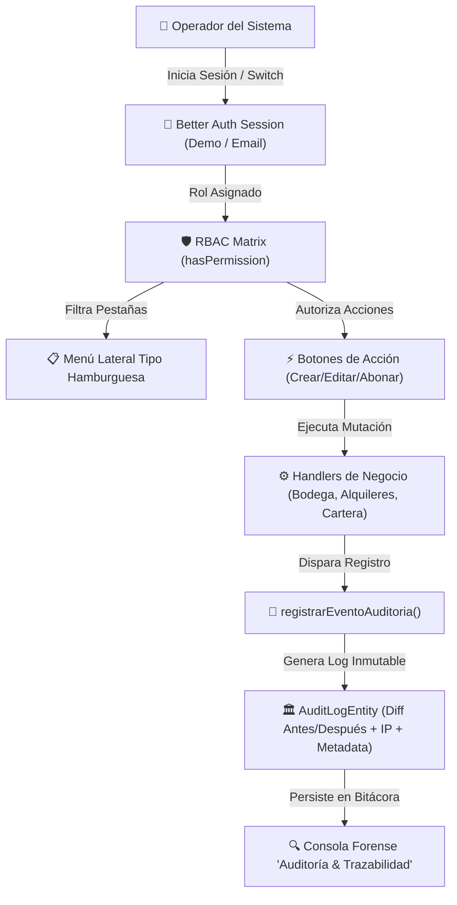

# 0005. Autenticación, Control de Acceso RBAC y Bitácora Global de Auditoría (Audit Trail)

Date: 2026-08-19

## Status
Accepted

## Context
A medida que **FerreOn ERP** evoluciona hacia una operación multi-rol en empresas de alquiler de maquinaria pesada y herramientas, se hacía indispensable:
1. **Autenticación y Control de Acceso**: Garantizar que cada operador acceda únicamente a los módulos y acciones correspondientes a su perfil de trabajo (`SUPERADMIN`, `ADMIN`, `OPERADOR_BODEGA`, `FACTURACION_CARTERA`, `CONSULTOR_AUDITOR`), evitando que personal de bodega emita facturas o que facturación modifique inventario físico sin autorización.
2. **Registro Inmutable de Auditoría (Audit Trail)**: Cada mutación crítica (creación de contratos, ajuste de stock, altas individuales o masivas de equipos, devoluciones con cobro de daños, emisión de cuentas de cobro y recaudos de cartera) debe quedar registrada de forma no repudiable con timestamp, identificador del operador, rol, módulo, acción, dirección IP y el diferencial de valores (*before/after diff*).

## Decision

Se implementó una arquitectura desacoplada y tipada bajo estándares **Better Auth + DDD + RBAC**:

### 1. Entidades de Dominio
- [`UsuarioEntity`](file:///c:/Users/USUARIO/Documents/Aplicaciones/FerreOn/Alquileres_erp/src/core/domain/entities/usuario.ts): Define `id`, `nombre`, `email`, `rol` (`RoleType`), `avatarUrl`, `activo`, `ultimoAcceso`. Valida invariantes y sanitización de correos electrónicos.
- [`AuditLogEntity`](file:///c:/Users/USUARIO/Documents/Aplicaciones/FerreOn/Alquileres_erp/src/core/domain/entities/audit-log.ts): Registro inmutable con identificador único secuencial `AUD-...`, marca de tiempo ISO, operador, rol, módulo (`AuditModuloType`), acción (`AuditActionType`), entidad asociada, descripción y diferencial JSON (`AuditDetalleCambio`).

### 2. Matriz Granular de Permisos (RBAC Matrix)
- [`src/lib/auth/rbac-matrix.ts`](file:///c:/Users/USUARIO/Documents/Aplicaciones/FerreOn/Alquileres_erp/src/lib/auth/rbac-matrix.ts):
  - Función pura `hasPermission(rol: RoleType, permission: Permission): boolean`.
  - Matriz exhaustiva `PERMISOS_POR_ROL` que rige tanto la visibilidad de las pestañas en el menú lateral como el renderizado condicional de botones de acción en la interfaz (`alquileres:create`, `bodega:adjust_stock`, `facturacion:emit`, `cartera:collect`, etc.).
  - Cuentas demo preconfiguradas (`Roberto Silva - SUPERADMIN`, `Carlos Gómez - OPERADOR_BODEGA`, `Luisa Peña - FACTURACION_CARTERA`, `Valeria Morales - CONSULTOR_AUDITOR`).

### 3. Casos de Uso y Repositorios
- [`IniciarSesionUseCase`](file:///c:/Users/USUARIO/Documents/Aplicaciones/FerreOn/Alquileres_erp/src/core/application/use-cases/auth-use-cases.ts), `VerificarPermisoUseCase`, `CrearUsuarioUseCase`.
- [`RegistrarAuditoriaUseCase`](file:///c:/Users/USUARIO/Documents/Aplicaciones/FerreOn/Alquileres_erp/src/core/application/use-cases/audit-use-cases.ts) y `ConsultarAuditoriaUseCase`.
- Interfaces `IAuthRepository` e `IAuditRepository`.

### 4. API Endpoints
- `/api/auth/[...all]`: Manejo de endpoints compatibles con Better Auth para consulta de sesión y autenticación.
- `/api/auditoria`: Consulta y registro de bitácora forense con soporte de filtros.
- `/api/usuarios`: Directorio de usuarios corporativos.

### 5. Interfaz de Usuario y Experiencia (UI/UX)
- **Tarjeta de Perfil en Menú Lateral**: Exhibe avatar con iniciales, nombre, badge con color temático del rol y botón de switch rápido.
- **Drawer Lateral Adaptativo**: Filtra las pestañas del menú según los permisos del usuario activo.
- **Nueva Pestaña 'Auditoría & Trazabilidad'**: Consola forense con tarjetas KPI (Total Eventos, Operadores Activos, Módulos Auditados), buscador por texto, selector por módulo y tabla de eventos con botón *Ver Diff*.
- **Modal de Detalle Forense**: Inspección de diferencias (*valor anterior vs. nuevo valor asignado*), IP del operador y metadata técnica JSON.
- **Modal de Login / Switch de Perfil Demo**: Cambio ágil de rol con 1 clic para validar y simular los permisos en tiempo de ejecución.

## Diagrama de Arquitectura de Seguridad y Auditoría

## Consequences

### Positive
- **Cumplimiento y Trazabilidad Total**: Cualquier alteración de precios, stock, estado de contratos o registros de dinero queda asentada con auditoría detallada.
- **Principio de Mínimo Privilegio**: Cada rol visualiza exclusivamente lo necesario para su función operativa.
- **Transparencia y Facilidad de Pruebas**: El modal de switch de usuarios permite a los evaluadores alternar entre roles en 1 segundo y comprobar cómo la interfaz oculta/muestra módulos y funciones.
- **Seguridad Compatible con Producción**: Base arquitectónica lista para conectar proveedores OAuth, JWT o persistencia en PostgreSQL / Supabase.

### Neutral
- Los eventos de auditoría se registran sincrónicamente en memoria y se complementan con endpoints de API en `/api/auditoria`.
