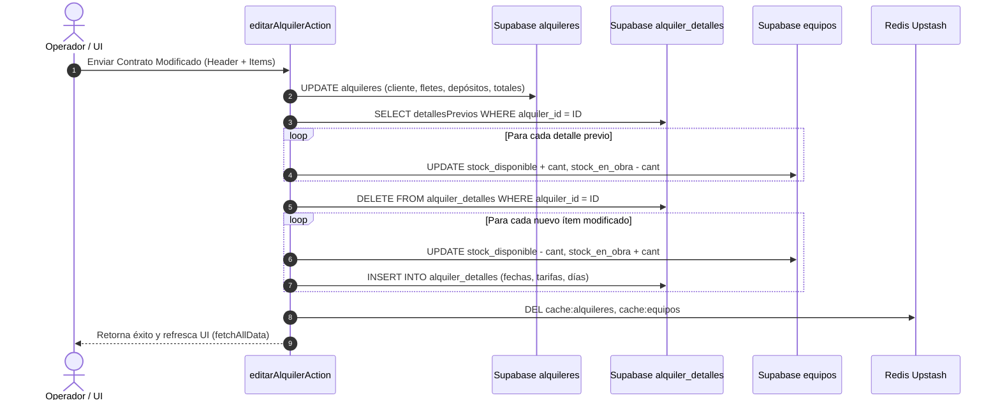

# Arquitectura de Persistencia Relacional y Middleware Edge Resiliente

**Módulo:** Transaccionalidad de Alquileres, Inventario y Edge Runtime  
**Aplicación:** Alquileres System (Next.js 14 App Router, Supabase PostgreSQL, Vercel Edge)  
**Fecha:** 2026-08-28  

---

## 1. Persistencia Relacional e Inventario en Edición de Contratos

### A. Problemática y Desafío Arquitectónico
En modelos de alquiler de maquinaria, una edición de contrato no es una simple mutación de cabecera:
1. El usuario puede cambiar la cantidad de equipos o reemplazar una máquina por otra.
2. Cada cambio de equipo altera el inventario físico: `stock_disponible` y `stock_en_obra`.
3. Si solo se actualizaba la cabecera `alquileres`, la tabla `alquiler_detalles` quedaba desfasada y el stock de bodega presentaba sobreventa o faltantes artificiales.

### B. Flujo Transaccional en `editarAlquilerAction` ([`src/app/actions/alquileres.ts`](file:///c:/Users/USUARIO/Documents/Aplicaciones/FerreOn/Alquileres_erp/src/app/actions/alquileres.ts))



---

## 2. Middleware Edge de Cero Latencia y Prevención de Timeouts (504)

### A. Diagnóstico del Error 504 `MIDDLEWARE_INVOCATION_TIMEOUT`
En Vercel Edge, los middlewares se ejecutan en servidores distribuidos (Cloudflare Workers / Vercel Edge Runtime) con presupuestos de tiempo de CPU y latencia muy reducidos ($\approx 1.5\text{s}$).

Cuando un middleware ejecuta llamadas de red externas incondicionales (`await supabase.auth.getUser()`) en cada petición estática o llamada API, la latencia acumulada provoca que Vercel termine la ejecución prematuramente arrojando `504 GATEWAY_TIMEOUT`.

### B. Estrategia de Mitigación Implementada ([`src/middleware.ts`](file:///c:/Users/USUARIO/Documents/Aplicaciones/FerreOn/Alquileres_erp/src/middleware.ts))

1. **⚡ Fast-Path Inmediato:**  
   Las rutas internas (`/_next`), llamadas de API (`/api/*`), autenticación (`/auth/*`), `/unauthorized` y assets estáticos retornan de inmediato con `NextResponse.next()` **sin instanciar ni consultar Supabase Auth**.
2. **⏱️ Timeout Guard de 1.2 Segundos:**  
   La verificación de usuario se ejecuta mediante `Promise.race` con un temporizador de 1200ms:
   ```typescript
   const timeoutPromise = new Promise<{ data: { user: null } }>((resolve) =>
     setTimeout(() => resolve({ data: { user: null } }), 1200)
   );
   const { data } = await Promise.race([
     supabase.auth.getUser(),
     timeoutPromise,
   ]);
   ```
3. **🍪 Métodos Modernos `@supabase/ssr`:**  
   Uso de `getAll()` y `setAll()` en lugar de métodos atómicos heredados para garantizar sincronización atómica de cookies sin bucles de reescritura.
