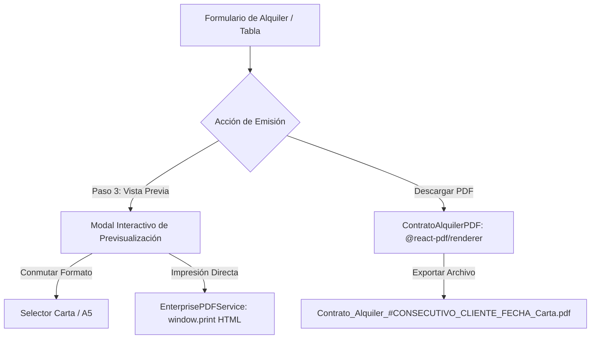

# Manual del Motor de Documentos PDF y Emisión Multiformato (Alquileres System)

**Módulo:** Emisión de Documentos, Previsualización y Formato Monetario  
**Aplicación:** Alquileres System (Next.js 14 App Router, Supabase PostgreSQL, Vercel)  
**Fecha:** 2026-08-28  

---

## 1. Arquitectura de Generación Dual

El sistema dispone de dos motores complementarios para la emisión de contratos, cotizaciones y cuentas de cobro:

### A. Motor Vectorial Nativo (`@react-pdf/renderer`)
- **Archivo:** [`src/components/pdf/ContratoAlquilerPDF.tsx`](file:///c:/Users/USUARIO/Documents/Aplicaciones/FerreOn/Alquileres_erp/src/components/pdf/ContratoAlquilerPDF.tsx)
- **Formatos Soportados:**
  - **Carta (`LETTER` - 216×279 mm):** Espaciado estándar, tipografía de 8.5pt/9pt, ideal para contratos legales y archivo digital formal.
  - **Media Carta (`A5` - 148×210 mm):** Tipografía compacta de 7.5pt/8pt y paddings de 16pt/18pt, ideal para remisiones rápidas de despacho en obra.
- **Fuentes Embebidas:** Tipografía *Roboto* (pesos 300, 400, 500, 700) cargada desde CDN sin bloqueos de renderizado.

### B. Servicio de Vista Previa e Impresión HTML (`window.print()`)
- **Archivo:** [`src/core/services/pdf-factura-generator.service.ts`](file:///c:/Users/USUARIO/Documents/Aplicaciones/FerreOn/Alquileres_erp/src/core/services/pdf-factura-generator.service.ts)
- Genera código HTML/CSS responsivo con directivas `@page { size: letter portrait; }` y `@page { size: A5 portrait; }`.
- Incluye barra de herramientas flotante (`toolbar no-print`) con selector de tamaño e impresión instantánea.

---

## 2. Estructura de la Tabla de Maquinarias (7 Columnas Obligatorias)

Cada renglón en la tabla del documento desglosa exhaustivamente:

| Columna | Descripción | Ejemplo |
| :--- | :--- | :--- |
| **1. Equipo / Maquinaria** | Nombre y código SKU del equipo | *Mezcladora de Trompo 1/2 Bulto (SKU-102)* |
| **2. Cant.** | Cantidad de unidades contratadas | `2` |
| **3. Desde** | Fecha de entrega / inicio de alquiler | `28/08/2026` |
| **4. Hasta** | Fecha de devolución estimada | `04/09/2026` |
| **5. Días** | Días efectivos calculados: $\max(1, \lceil\Delta t / 24\text{h}\rceil)$ | `7` |
| **6. Tarifa / Día** | Tarifa unitaria pactada por día | `$ 45.000` |
| **7. Subtotal Est.** | $\text{Cantidad} \times \text{Tarifa} \times \text{Días}$ | `$ 630.000` |

---

## 3. Liquidación Financiera y Representación en Letras

La liquidación en el PDF y en el modal de vista previa se calcula con precisión matemática estricta:

$$\text{Subtotal Equipos} = \sum (\text{Subtotales de Renglón})$$
$$\text{Total General} = \text{Subtotal Equipos} + \text{Flete Entrega} + \text{Flete Recogida}$$
$$\text{Saldo Pendiente} = \max(0, \text{Total General} - \text{Depósito / Anticipo})$$

- **Monto en Letras Oficial:** Se procesa mediante [`src/core/utils/numero-a-letras.ts`](file:///c:/Users/USUARIO/Documents/Aplicaciones/FerreOn/Alquileres_erp/src/core/utils/numero-a-letras.ts), mostrando el valor legal formal:  
  `SON: SEISCIENTOS TREINTA MIL PESOS M/CTE`.

---

## 4. Asistencia Monetaria Verbal en Formularios UI

Debajo de los inputs monetarios (Tarifa Diaria, Fletes, Garantía y Depósito), se renderiza en tiempo real la ayuda textual:
- `$ 10.000 (Diez mil pesos)`
- `$ 350.000 (Trescientos cincuenta mil pesos)`
- `$ 1.500.000 (Un millón quinientos mil pesos)`

---

## 5. Nomenclatura Estandarizada de Archivos

Al presionar los botones de descarga, el sistema genera nombres de archivo sanitizados (sin caracteres especiales ni tildes):
`Contrato_Alquiler_#CONSECUTIVO_CLIENTE_FECHA_FORMATO.pdf`

Ejemplos:
- `Contrato_Alquiler_#00101_Andres_Joaquin_Luna_2026-08-28_Carta.pdf`
- `Contrato_Alquiler_#00101_Andres_Joaquin_Luna_2026-08-28_A5.pdf`
