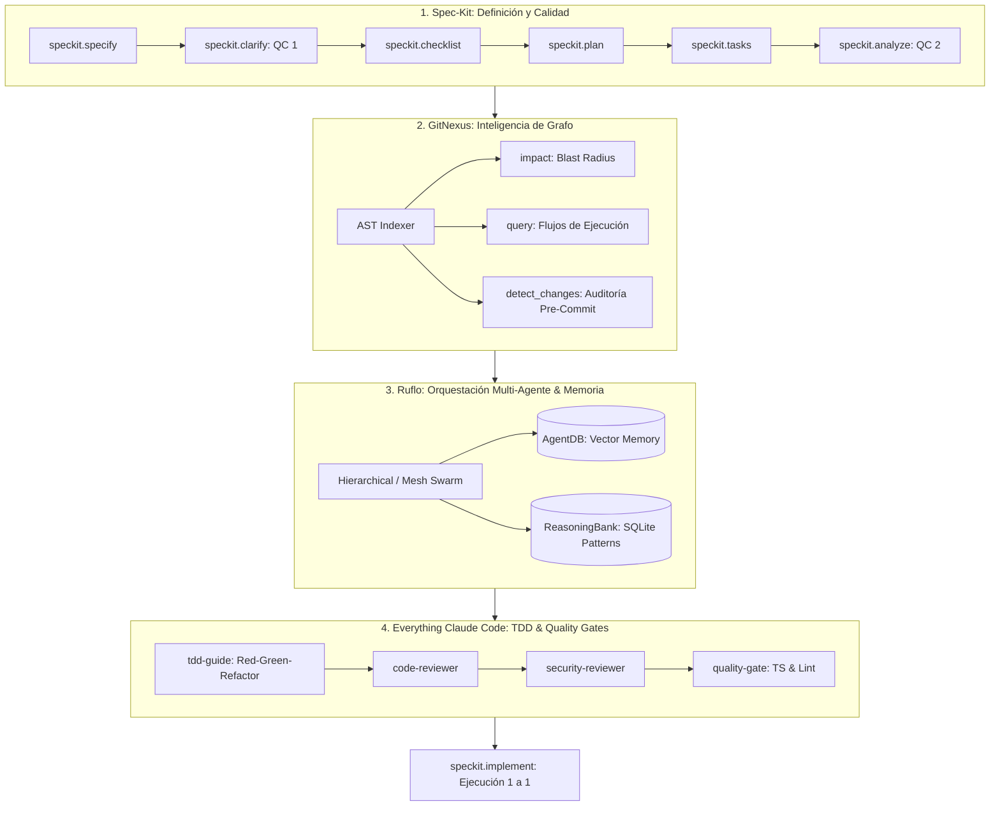

# Guía Maestra: Toolchain Integrado de Desarrollo

Este documento detalla la integración armónica de las **4 herramientas avanzadas de ingeniería de software aumentada por IA** configuradas en el proyecto **FerreOn**:

---

## 1. Ruflo (`ruvnet/ruflo`) — Orquestación y Memoria

- **Propósito:** Plataforma líder para coordinar enjambres (*swarms*) de agentes autónomos, persistencia de razonamiento y memoria vectorial.
- **Directorio de Configuración:** `.claude-flow/` y `.swarm/`
- **Habilidades Asignadas:**
  - `ruflo-orchestration`: Gestión de topologías (Jerárquica, Malla, Anillo).
  - `ruflo-memory`: Persistencia en `AgentDB` y `ReasoningBank`.

---

## 2. GitNexus (`abhigyanpatwari/GitNexus`) — Inteligencia de Código

- **Propósito:** Mapeo de grafos de dependencias AST, trazabilidad de flujos y análisis de radio de explosión (*blast radius*).
- **Directorio de Configuración:** `.gitnexus/`
- **Herramientas Obligatorias:**
  - `impact({target, direction: "upstream"})`: Ejecución obligatoria antes de editar cualquier símbolo de código.
  - `detect_changes()`: Validación pre-commit para confirmar que solo los procesos esperados fueron alterados.
  - `query({search_query})`: Localización rápida de flujos de ejecución sin lecturas masivas.
- **Habilidad Asignada:** `gitnexus-intelligence`

---

## 3. Everything Claude Code — ECC (`affaan-m/ecc`) — Agentes y Calidad

- **Propósito:** Catálogo de 64 subagentes especializados, TDD con 80%+ de cobertura y revisiones de seguridad.
- **Directorio de Configuración:** `.agent/`
- **Estándares Inmutables:**
  - **Inmutabilidad:** Jamás mutar objetos directamente.
  - **TDD Obligatorio:** Escribir tests unitarios (`tests/unit/`) antes del código de producción.
  - **Security-First:** Validación estricta en fronteras con Zod y sanitización.
- **Habilidad Asignada:** `ecc-orchestrator` y regla `ecc-standards.md`.

---

## 4. Spec-Kit (`github/spec-kit`) — Desarrollo por Especificación

- **Propósito:** Metodología rigurosa para convertir requerimientos en especificaciones verificables antes de tocar código.
- **Directorio de Configuración:** `.specify/`
- **Ciclo de Comandos:**
  1. `/speckit.specify`: Qué y Por qué en PRD.
  2. `/speckit.clarify`: Preguntas estructuradas para mitigar riesgos.
  3. `/speckit.checklist`: Verificación contra estándares de la industria.
  4. `/speckit.plan`: Definición de componentes, esquemas y flujos ("Cómo").
  5. `/speckit.tasks`: Desglose granular y secuencial en `task.md`.
  6. `/speckit.analyze`: Auditoría cruzada buscando fisuras o memory leaks.
  7. `/speckit.implement`: Ejecución **una tarea a la vez con confirmación**.
- **Habilidad Asignada:** `speckit-workflow` y constitución `.specify/CONSTITUTION.md`.

---

## 5. Cheat Sheet de Comandos

| Comando | Herramienta | Acción |
| :--- | :--- | :--- |
| `impact({target, direction: "upstream"})` | GitNexus | Evalúa qué se romperá antes de editar |
| `node .gitnexus/run.cjs analyze` | GitNexus | Re-indexa el grafo de código |
| `/speckit.specify` | Spec-Kit | Genera especificación PRD inicial |
| `/speckit.analyze` | Spec-Kit | Audita fisuras en la planeación |
| `/speckit.implement` | Spec-Kit | Inicia ejecución controlada paso a paso |
| `/tdd-workflow` | ECC | Guía la creación de tests antes del código |
| `/security-scan` | ECC | Escaneo de vulnerabilidades y permisos |
| `/learn` | Ruflo / ECC | Extrae y persiste heurísticas validadas |
