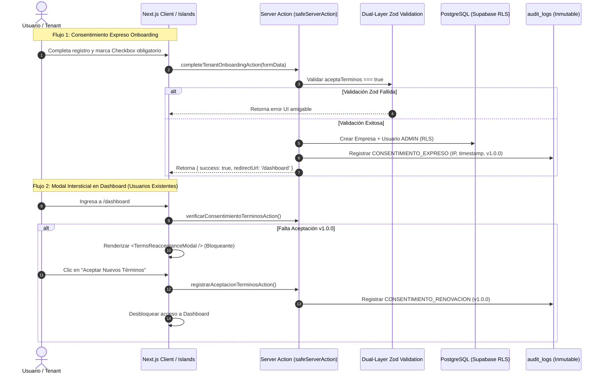

# Plan Técnico de Implementación: Blindaje Legal y Seguridad de Código

**Identificador:** `PLAN-LEGAL-APPSEC-001`  
**Referencia:** `SPEC-2026-LEGAL-APPSEC-BLINDAJE-001`  
**Estatus:** APROBADO EN CLARIFICACIÓN (QC 1 COMPLETADO)  
**Fecha:** 26 de Septiembre de 2026  

---

## 1. Arquitectura de Componentes y Flujos

---

## 2. Estructura de Archivos a Crear y Modificar

| Acción | Archivo | Propósito |
| :--- | :--- | :--- |
| **MODIFICAR** | `src/app/terminos/page.tsx` | Incorporar Cláusulas 6 (Exención de responsabilidad, As Is, Liability Cap) y 7 (Transparencia IA, no sesgo). |
| **MODIFICAR** | `src/app/privacidad/page.tsx` | Detallar roles Responsable vs Encargado, aislamiento RLS y política de cookies técnicas. |
| **CREAR** | `src/components/legal/ConsentCheckbox.tsx` | Componente reutilizable accesible (ARIA) con estados de validación y links seguros. |
| **CREAR** | `src/components/legal/TermsReacceptanceModal.tsx` | Modal bloqueante para el Dashboard que detecta si el usuario aceptó la versión `1.0.0`. |
| **CREAR** | `src/infrastructure/security/safeServerAction.ts` | Envoltorio universal con `correlationId`, log estructurado privado y mensajes cliente opacos. |
| **CREAR** | `src/core/security/promptSanitizer.ts` | Utilidad de sanitización y encapsulamiento XML para entradas de texto procesadas por IA. |
| **CREAR** | `src/config/env.ts` | Esquema Zod fail-fast para validar variables de entorno en el arranque de la aplicación. |
| **CREAR** | `scripts/audit-licenses.mjs` | Script de análisis de dependencias que bloquea licencias Copyleft virulentas (GPL, AGPL). |
| **MODIFICAR** | `src/components/ui/neumorphism/NeuExcelImportWizard.tsx` | Migrar llamadas de `xlsx` a `exceljs` para erradicar dependencias de licenciamiento ambiguo. |
| **MODIFICAR** | `package.json` | Agregar script `"audit:licenses": "node scripts/audit-licenses.mjs"` y actualizar dependencias. |
| **MODIFICAR** | `src/app/actions/caja.ts` y `alquileres.ts` | Integrar el envoltorio `safeServerAction` para evitar fugas de esquemas de BD. |
